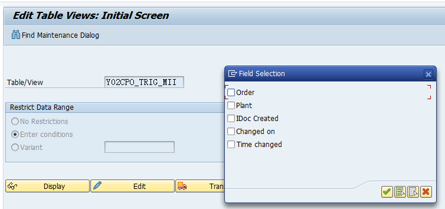
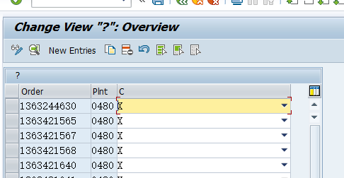
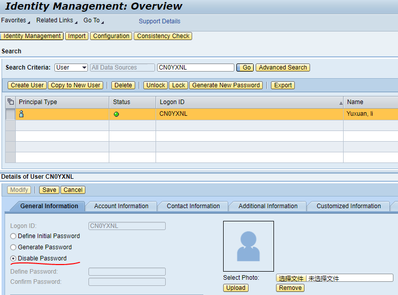
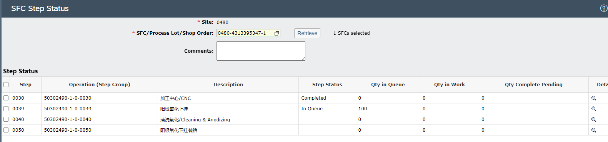
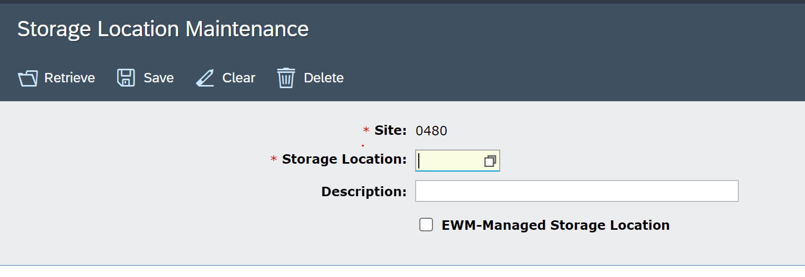
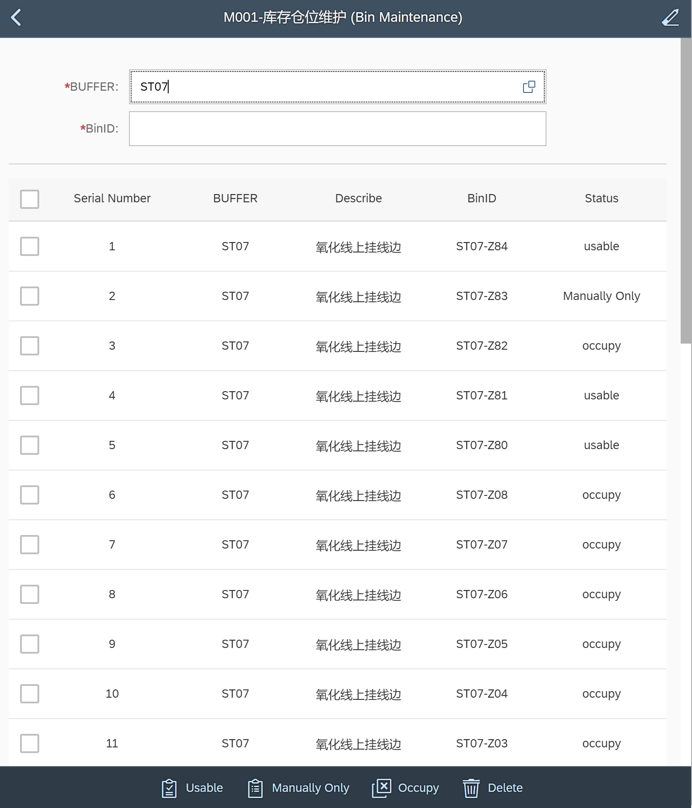
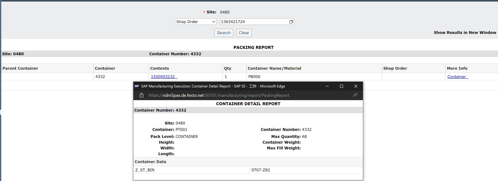
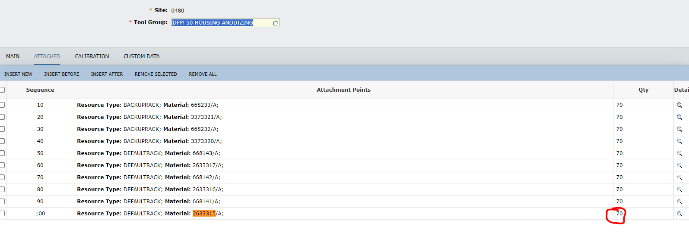
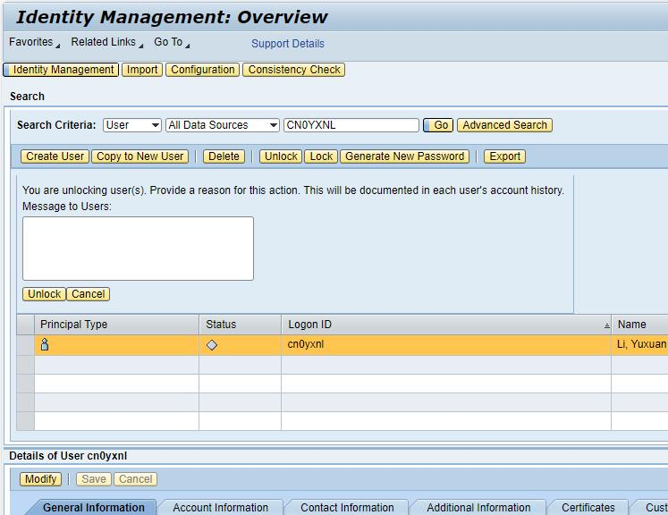
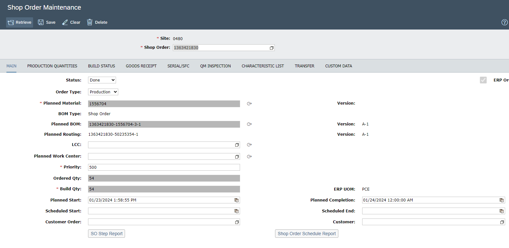

# 2023/12/4
### 1.解决订单无法从ERP传送的ME的问题
#### 业务描述

> 有一个业务场景是，如果某道工序需要在ERP确认然后再同步到ME中的话。
> 
> 1.ERP工序会维护PRT ME_1026,然后SAP ME对应工作中心会维护一个od_partial
> 
> 2.订单通过IDOC传到ME的时候，系统会判断上面那两个条件，如果都满足会在table  Z_MEUI5_WRKEXT中增加一个RFC_UPDATE的记录，
> 3.当MII job同步完成之后，系统会创建0480-xxx-xx的SFC,这个RFC_UPDATE也会清掉变成---。
> 
> 但是，有时候业务会遇到一种常见的错误，ERP维护了PRT ME_1026,但是ME中忘记维护OD_PARTIAL了，这个时候系统是不会给在Z表中创建如下记录的，手工处理方式就是干预数据库，然后等MII 后台job运行完成后一切正常。
> 长远看，可以先问一下Martin,有没有api 重新去更新Table `Z_MEUI5_WRKEXT` ? 如果没有可能需要自己搞一个api去做手工干预类似的动作了。

#### 解决方法
可以直接写入`Z_MEUI5_WRKEXT`表中，新增一条记录。但是要避免出现重复的记录。

因此检查条件是根据根据订单和`Ex_processing_opration`进行查询，如果存在记录就不用处理，否则设置`Ex_processing_opration`为`RCF_UPDATE`。当写入表之后，系统会将这个单子传送到ME。
> 需要注意的是，如果`Z_MEUI5_WRKEXT`中本身没有这个单子的记录，那么还需要从ERP手动的将这个单子推送一下才可以。具体的做法如下。

* 首先需要进入到`SAP EASY ACCESS`中，然后进入P22系统登陆。
* 输入事务代码`SM30`
* 输入要操作的表名称：`Y02CPO_TRIG_MII`
* 可以按照条件进行查询，例如按照Plant和Order进行查询
* 查询出相应的单子以后，把`IDoc Created`字段设置为空即可。

> 所有已经发送到ME的单子可以在`MII`中的`Queue Monitor`中进行查看。

### 如何帮用户解锁账号

* 进入NWA
* 右上角搜索关键字`identity`
* 找到`Identity Management`
* 输入用户名后，选择`Disable Password`保存即可

### 如何查看bin, 小车，箱子之间的绑定关系
下面的例子是通过查询指定SFC所在的箱子号
``` sql
SELECT
	CM.HANDLE,
	CM.CONTAINER_DATA_BO,
	CM.CONTAINER_NUMBER_BO,
	CM.SFC_BO,
	CCD.DATA_ATTR AS Z_ST_BIN
FROM
	CONTAINER_MEMBER CM
	LEFT JOIN CONTAINER_CUSTOM_DATA CCD ON CM.CONTAINER_DATA_BO = CCD.CONTAINER_DATA_BO
	AND CCD.DATA_FIELD = 'Z_ST_BIN'
WHERE
	CM.SFC_BO = 'SFCBO:0480, 0480-4313395347-1'
```


| HANDLE                                              | CONTAINER_DATA_BO               | CONTAINER_NUMBER_BO | SFC_BO                       | Z_ST_BIN |
| --------------------------------------------------- | ------------------------------- | ------------------- | ---------------------------- | -------- |
| ContainerMemberBO:ContainerDataBO:0480,1500002933,1 | ContainerDataBO:0480,1500002933 | ---                 | SFCBO:0480,0480-4313395347-1 | ---      |

> 下面的结果表明，名字为`0480-4313395347-1`的SFC被存在在了编号为`1500002933`箱子中。

那如何查询`1500002933`在哪个小车和再哪个BIN上呢？使用下面的SQL语句

```sql
SELECT
	CM.HANDLE,
	CM.CONTAINER_DATA_BO,
	CM.CONTAINER_NUMBER_BO,
	CM.SFC_BO,
	CCD.DATA_ATTR AS Z_ST_BIN
FROM
	CONTAINER_MEMBER CM
	LEFT JOIN CONTAINER_CUSTOM_DATA CCD ON CM.CONTAINER_DATA_BO = CCD.CONTAINER_DATA_BO
	AND CCD.DATA_FIELD = 'Z_ST_BIN'
WHERE
	CM.CONTAINER_NUMBER_BO = 'ContainerDataBO:0480,1500002933'
```


| HANDLE                                        | CONTAINER_DATA_BO         | CONTAINER_NUMBER_BO             | SFC_BO | Z_ST_BIN |
| --------------------------------------------- | ------------------------- | ------------------------------- | ------ | -------- |
| ContainerMemberBO:ContainerDataBO:0480,3760,1 | ContainerDataBO:0480,3760 | ContainerDataBO:0480,1500002933 | ---    | ST07-A05 |

> 上面的查询结果表明了编号为`1500002933`的箱子被存放在编号为`3760`的小车上。同时这个小车所在的bin为`ST07-A05`

### 接口日志查询

调用的一些`external interface`都会记录日志，所有的日志都存放在`Z_MEUI5_INTF_LOG`表中。因此一些接口出现问题可以查询这个表。

比如查询呼叫AGV的接口日志。
```sql
SELECT
	*
FROM
	Z_MEUI5_INTF_LOG
WHERE
	INTERFACE_NAME = 'callAgv'
ORDER BY
	CREATE_TIEM DESC
```


### 关于报工的一些细节问题
所谓报工，就是对某一个工序进行确认已经完成，又名`Order Confirm`，`Sfc Complete`等。报工主要需要以下的信息。
* 订单号或者SFC号
* 确认数量。用于确认为部分报工还是最终报工
* 工作中心。会根据工作中心查询工步，判断是否可以报工。例如在氧化线上挂的POD中，只允许报工`C3300716`工作中心对应的`0030`工步。

我们可以在ME的标准界面中搜索`SFC Step Status`，查看当前SFC的对应的所有工步的完成情况。

例如下面的图就是一个SFC每一个工步的状态。如果完全报工了，则状态为`Complete`，所有的数量会进入到下一个工步，状态变为`In Queue`。


当然也会存在部分报工的情况。如果是部分报工的情况。比如在STEP01中一共有200个PC，但是进行了一次部分报工，数量为10。那么此时SFC状态为STEP01为`In Queue`，并且`In Queue`数量会变成190。同时STEP02也会为`In Queue`，并且`In Queue`数量会变成10。

### 2023/12/13
### 仓位维护以及Buffer的创建
在M001中，提供了对仓位的创建，状态的维护和查询的功能。
> 如果需要创建一个新的BIN，可以首先输入对应的Buffer，然后在binId中输入想要创建的bin，然后点击回车即可。
> 新创建的Bin状态是`NEW`，需要选中这个bin，然后将它的状态设置为可用或者仅限人工绑定两种。
> 同时还可以在这个里面查询所有的Bin的状态

> 如果当前的Buffer还没有创建的话，会出现`Error code:100030480；Error describe:Buffer [ST99] non existent`。如果出现上述错误需要在ME的标准界面`Storage Location Maintainance`中创建。在Storage Location中输入要创建的Buffer点击保存即可
> 
>

### 如何在标准的ME中查询订单绑定信息
进入`packing report`，输入要查询的SFC或者订单号。


### 如何创建一个分批的单子
<video src="assets/demo.mp4" controls="controls" width="auto" height="300"></video>

### 在氧化排序界面上查询某一个单子是否缺少挂具
首先根据订单，进入到H表中查询其对应的挂具类型
```sql
SELECT * FROM Z_MEUI5_TASK_H
WHERE SHOP_ORDER = ''
```
根据表中的挂具类型和物料类型，到ME标准界面选择`Tool Group Maintainance`，查询当前挂具组对应物料可以挂的数量


然后查询当前挂具组下面可以使用的挂具的个数
```sql
SELECT
    TM.HANDLE,
    TM.TOOL_NUMBER,
    TM.DESCRIPTION,
    TM.CREATED_DATE_TIME,
    TM.MODIFIED_DATE_TIME,
    S.STATUS,
    S.STATUS_DESCRIPTION
FROM
    TOOL_NUMBER TM
    INNER JOIN STATUS S ON TM.STATUS_BO = S.HANDLE
WHERE
    TM.SITE = '0480'
    AND TM.TOOL_GROUP_BO = 'ToolGroupBO:0480,DFM-50 HOUSING ANODIZING'
    AND S.STATUS = '301'
```

根据下面的公式计算得出所有可用的数量
``` 当前挂具组对应物料可以挂的数量　*　当前挂具组下可用挂具数量```


### Eclipse 如何解锁
用NWA账号进到 NWA 在identity里面可以解锁


### 手持M009物流表单查询逻辑
首先，物料表单的作用是查询当前的订单应该送往哪一个工作中心。当点击相应的Supply Area后，可以查询到当前Supply Area下所有满足
下面是对应的SQL语句。简单来说，就是查询所有符合**SFC的下一步工作中心符合给定工作中心条件**的工单，并且根据Supply Area进行分组求和，
```sql
with CTE AS (
    SELECT
        SO.SHOP_ORDER,
        SS.REPORTING_CENTER_BO,
        S.SFC,
        SD.DATA_FIELD,
        SD.DATA_ATTR,
        S.CREATED_DATE_TIME,
        SS.PREVIOUS_STEP_ID,
        I.ITEM,
        IT.DESCRIPTION,
        S.QTY,
        CONCAT(SUBSTRING(RO.HANDLE, 0, 73), SS.PREVIOUS_STEP_ID) AS NEW_COL
    FROM
        SFC_STEP SS
        INNER JOIN SFC_ROUTER SR ON SS.SFC_ROUTER_BO = SR.HANDLE
        INNER JOIN SFC_ROUTING SRG ON SR.SFC_ROUTING_BO = SRG.HANDLE
        INNER JOIN SFC S ON S.HANDLE = SRG.SFC_BO
        INNER JOIN ROUTER_STEP RS ON RS.ROUTER_BO = SR.ROUTER_BO
        INNER JOIN ROUTER_OPERATION RO ON RO.ROUTER_STEP_BO = RS.HANDLE
        LEFT JOIN SFC_DATA SD ON SD.SFC_BO = SRG.SFC_BO
        AND (
            SD.DATA_FIELD = 'Z_CLOSE_TIME'
            OR SD.DATA_FIELD = 'Z_CLOSE_BUFFER'
            OR SD.DATA_FIELD = 'Z_BIND_TIME'
        )
        INNER JOIN SHOP_ORDER SO ON SO.HANDLE = S.SHOP_ORDER_BO
        INNER JOIN ITEM I ON SO.ITEM_BO = I.HANDLE
        INNER JOIN ITEM_T IT ON IT.ITEM_BO = I.HANDLE
        AND IT.LOCALE = 'zh'
    WHERE
        S.SITE = '0480'
        AND SS.STEP_ID = RS.STEP_ID
        AND S.STATUS_BO IN ('StatusBO:0480,402', 'StatusBO:0480,401')
        AND SS.PREVIOUS_STEP_ID IS NOT NULL
        AND (
            SS.QTY_IN_QUEUE > 0
            OR SS.QTY_IN_WORK > 0
        )
        AND SD.DATA_ATTR IS NULL
        AND SS.REPORTING_CENTER_BO IN (
            'WorkCenterBO:0480,C3260106',
            'WorkCenterBO:0480,C3120202',
            'WorkCenterBO:0480,C3200401',
            'WorkCenterBO:0480,C3200402',
            'WorkCenterBO:0480,C3300716',
            'WorkCenterBO:0480,C3300503'
        )
)
SELECT
    CTE.SHOP_ORDER,
    CTE.SFC AS SFC,
    CF.VALUE AS SYPPLY_AREA,
    CTE.CREATED_DATE_TIME,
    CF1.VALUE AS SUPPLY_AREA_DESC,
    CTE.ITEM,
    CTE.DESCRIPTION AS ITEM_DESC,
    CTE.QTY AS QTY
FROM
    CUSTOM_FIELDS CF
    INNER JOIN CTE ON CF.HANDLE = CTE.NEW_COL
    AND CF.ATTRIBUTE = 'Y_SUPPLY_AREA'
    LEFT JOIN CUSTOM_FIELDS CF1 ON CF1.HANDLE = CTE.NEW_COL
    AND CF1.ATTRIBUTE = 'Y_SUPPLY_AREA_DESC'
WHERE
    CF.VALUE = 'P10V1'
ORDER BY
    CTE.CREATED_DATE_TIME DESC
```

> 相关知识: 如何查询当前SFC的下一个工作中心是什么
> 1. 首先根据SFC到`SFC`表中查询SFC的对应的`ShopOrderBO`
> 2. 根据`ShopOrderBO`到`ShopOrder`表中查询`PLANNED_ROUTER_BO`
> 3. 根据`PLANNED_ROUTER_BO`到`ROUTER_NEXT_STEP`表中获取到`NEXT_STEP_BO`
> 4. 然后根据`NEXT_STEP_BO`到`ROUTER_STEP`中查询`REPORTING_CENTER_BO`字段, 这个字段里面保存的数据就是当前SFC的下一个工作中心


### 如何删除Data Field Maintenance里面的数据
将光标放在要删除的行的最后的那个输入框里面，就可以删除了。


### 确认0件导致订单关闭的问题

由于系统设计中的BUG, 在WAS中允许确认0件，导致ME将订单关闭。

下面展示一旦出现这种订单关闭的情况，应该如何处理。处理主要分为了一下三步：

具体操作如下：


经过处理后，SFC的状态将会回归正常。需要注意的是，完成这一步后，刚才确认0件的工序需要重新确认。


### 氧化线check list
* Workbasket界面
  * 测试订单是否可以正常loading
  * 创建新订单测传到ME，看是否会影响loading
  * 测试订单优先级按钮是否可以正确设置订单优先级、取消优先级，并测试是否可以正常loading （需要分别测试不同状态的单子）
  * 测试挂具选择挂具、订单是否显示正确
  * 测试是否可以正常选择挂具（需要分别测试部分、可上挂订单）
  * 测试查询绑定信息按钮显示的绑定信息是否正确
  * 测试AGV任务是否可以正常呼叫，AGV任务是否可以正常生成
  * 测试完成AGV按钮，分别需要测试待配送和异常两种情况，多选和单选状态
  * 强制DOEN按钮是否正常工作
  * 撤销上挂中按钮，需要测试（部分->上挂中）（可上挂->上挂中）是否工作正常，检查挂具列和上挂数量列
* M017氧化上挂界面
  * 测试直接输入挂具号，相关订单号是否自动显示
  * 扫描订单号是否可以直接上挂
  * 报工部分测试部分确认和最终确认
  * 测试撤销是否正常工作（部分，上挂中）
* 测试SFC Start接口是否正常工作
* M018氧化下挂界面
  * 测试是否能够正确解绑
* 呼叫AGV任务
* 一个单子一个SFC一个车
* 一个单子多个SFC，每一个SFC不同的车
* 一个单子多个SFC，每一个SFC又装到了不同的车上

### 更新了WorkCenter的Custom Data字段后在WAS界面不生效
经过观察代码发现，所有的工作中心配置实际上都已经被缓存到了系统当中。每一次进入workbasket的时候，都会向后端发起请求，获取当前工作中心的alias名。
```JavaScript
/**
 * retrieves the configured viewAlias that is configured on the ME
 * workcenter from the backend
 */
getViewAliasForWorkcenter: function(site, workcenter){
    var queryUri = "/" + site + "/" + workcenter;
    var response = getGlobalContext().getWebService().loadJSONData("getWorkcenterViewAlias",null,"GET", queryUri);
    
    return response.getData().viewAlias;
},
```
```java
	/**
	 * Retrieves the requested data object from the cache. For in case data validity
	 * is outdated or object is not yet cached it is automatically updated.
	 * 
	 * @param site
	 * @param workcenter
	 * @return
	 * @throws BusinessException
	 */
	@Path("getCachedWorkcenter/{site}/{workcenter}")
	@GET
	public WorkcenterCacheData getCachedWorkcenter(@PathParam("site") String site,
			@PathParam("workcenter") String workcenter) throws BusinessException {
		try {

			if (site == null || site.trim().isEmpty() || workcenter == null || workcenter.trim().isEmpty()) {
				throw new BusinessException(Errors.ERROR_INSUFFICIENT_INPUT.getCode(),
						"site and workcenter must be given. One or both were empty! site = " + site + ", workcenter ="
								+ workcenter);
			}

			// check if we have data in the cache - then we use the cached version - if not
			// we need to load it via PAPI and cache it
			WorkcenterCache cache = WorkcenterCache.getInstance();
			if (cache.isCached(site, workcenter)) {
				return cache.getCachedItemLeacy(site, workcenter);
			} else {
				this.initServiceLocator(site);

				String workcenterRef = Context.convertWorkcenterToWorkcenterRef(workcenter, site);
				WorkCenterFullConfiguration wcFullConfig = this.getWorkCenterConfigurationService()
						.readWorkCenter(new ObjectReference(workcenterRef));

				cache.updateCache(site, wcFullConfig);
				return cache.getCachedItemLeacy(site, workcenter);
			}

		} catch (Exception e) {
			this.handleExceptionForUIService(getClass(), "getCachedWorkcenter",
					"Error reading cached workcenter data for site= " + site + ", workcenter= " + workcenter, e, null,
					null);
		}

		return null;
	}
```

### 根据订单查询PRT
要查询工单的PRT，使用下面的SQL语句
```sql
SELECT CF.VALUE AS PRT
FROM SHOP_ORDER SO
INNER JOIN ROUTER_STEP RS ON RS.ROUTER_BO = SO.PLANNED_ROUTER_BO
INNER JOIN CUSTOM_FIELDS CF ON CF.HANDLE = RS.ROUTER_COMP_GBO
WHERE CF.ATTRIBUTE = 'Y_PRT'
AND SO.SHOP_ORDER = '1364742284'
AND RS.REPORTING_CENTER_BO = 'WorkCenterBO:0480,C3300716'
```


### 根据SFC查询所在订单和当前工作中心
```sql
SELECT
    S.SHOP_ORDER_BO,
    SS.REPORTING_CENTER_BO
FROM
    SFC_STEP SS
    INNER JOIN SFC_ROUTER SR ON SS.SFC_ROUTER_BO = SR.HANDLE
    INNER JOIN SFC_ROUTING SRG ON SR.SFC_ROUTING_BO = SRG.HANDLE
    INNER JOIN SFC S ON S.HANDLE = SRG.SFC_BO
    INNER JOIN ROUTER_STEP RS ON RS.ROUTER_BO = SR.ROUTER_BO
WHERE
    SRG.SFC_BO = 'SFCBO:0480,0480-4314378301-1'
    AND SS.STEP_ID = RS.STEP_ID
    AND (
        SS.QTY_IN_QUEUE > 0
        OR SS.QTY_IN_WORK > 0
    
```


### AGV状态和MES同步
AGV每进入一个新的状态，都会通过`/agvInterface`接口向MES回传任务的状态信息，所有AGV回传MES的信息，可以通过下面的SQL语句找到
```sql
SELECT * FROM Z_MEUI5_INTF_LOG
WHERE CREATE_TIEM like '2024-02-17%'
AND INTERFACE_NAME = 'synAgvState'
ORDER BY CREATE_TIEM
```
例如，当AGV已经将小车运送到终点后，会通过`agvInterface/synAgvState.do`接口向MES回传信息
```json
{
    "taskId" : "202210131353457919449646", 
    "state" : "unloadingDestPoint"
}
```
当MES接收到请求后，会根据`taskId`到M表中查询AGV任务的详细信息，并进行处理，具体逻辑如下：
* 当路线类型为`BTB`，`LTB`，`BTL`，状态为`manualClose`：当AGV回传参数中出现`manualClose`，则会更新M表中AGV任务的状态为终止状态，并将目的地的仓位状态设置为可用
* 当路线类型为`BTB`，`BTL`，状态为`leaveStartPoint`：会将起始地的仓位状态修改为可用，并更新AGV任务状态为离开起始地
* 当路线类型为`BTB`，状态为`unloadingDestPoint`：
  * 会检查小车是否已经绑定仓位，如果没有绑定，则将小车和目的地仓位进行绑定，并修改AGV任务状态
  * 根据从M表获取的工作中心，查询H表中当前SFC是否都已经运送完毕，如果都运送完毕，则修改H表中AGV的配送状态为完成
* 当路线类型为`LTB`，状态为`unloadingDestPoint`：
  * 会检查小车是否已经绑定仓位，如果没有绑定，则将小车和目的地仓位进行绑定，并修改AGV任务状态
  * 然后从`Z_IS_ARRIVED_WORKCENTER`中取出所有配置的工作中心，看看当前任务是否在配置的工作中心里面
  * 如果该工作中心已经配置，则需要查询是否所有的SFC都已经配送完成，如果配置完成，则将该SFC进行关闭批次操作。（写入`Z_SFC_STATE`为`TO_SORT`）

> `Z_IS_ARRIVED_WORKCENTER`在`Activity Maintaince`里面设置，`ActivityID`为`Z_SYN_AGV_STATE`


value	"<?xml version="1.0" encoding="UTF-8"?><Rowsets DateCreated="2024-02-27T15:04:24" EndDate="2022-08-31T14:27:30" StartDate="2022-08-31T14:27:30" Version="15.4 SP1 Patch 38 (Jun 1, 2023)">\n    <Rowset>\n        <Columns>\n            <Column Description="" MaxRange="1" MinRange="0" Name="ORDER_NUMBER" SQLDataType="1" SourceColumn="ORDER_NUMBER"/>\n            <Column Description="" MaxRange="1" MinRange="0" Name="MATERIAL" SQLDataType="1" SourceColumn="MATERIAL"/>\n            <Column Description="" MaxRange="1" MinRange="0" Name="PROJECT" SQLDataType="1" SourceColumn="PROJECT"/>\n            <Column Description="" MaxRange="1" MinRange="0" Name="PROJECT_PATH" SQLDataType="1" SourceColumn="PROJECT_PATH"/>\n        </Columns>\n        <Row>\n            <ORDER_NUMBER>TEST825189</ORDER_NUMBER>\n            <MATERIAL>MATNR825189</MATERIAL>\n            <PROJECT>G1_CS.1475705..A</PROJECT>\n            <PROJECT_PATH>/dfs01/INT/Data/CustomerSolutions/CS/G1_CS/14757xx/1475705/A/3_Assembly/3.2_Construction_documentation</PROJECT_PATH>\n        </Row>\n    </Rowset>\n</Rowsets>" (id=450)	
